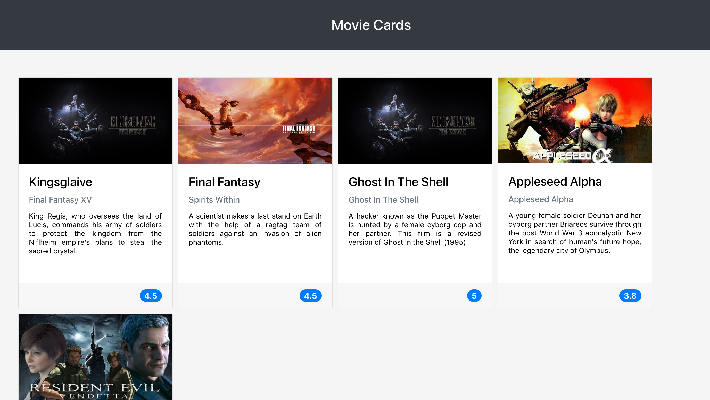

# Projeto Movie Cards Library
Esse projeto foi desenvolvido no módulo de front-end durante minha formação na [Trybe](https://www.betrybe.com/formacao-desenvolvimento-web) em Desenvolvimento Web.

### Habilidades que froram avaliadas

  - Saber a melhor forma para instalar um gerenciador de pacotes
  - Inicializar um projeto em **React**
  - Utilizar JSX no **React**
  - Utilizar o **ReactDOM.render** para renderizar elementos numa página web
  - Utilizar o `import` para usar código externo junto ao seu
  - Criar componentes **React** corretamente
  - Fazer uso de `props` corretamgitente
  - Fazer composição de componentes corretamente
  - Criar múltiplos componentes dinamicamente
  - Utilizar **PropTypes** para checar o tipo de uma prop no uso de um componente
  - Utilizar **PropTypes** para garantir a presença de props obrigatórias no uso de um componente
  - Utilizar **PropTypes** para checar que uma prop é um objeto de formato específico
  - Utilizar **PropTypes** para garantir que uma prop é um array com elementos de um determinado tipo

### O que foi desenvolvido

Uma biblioteca de cartões de filmes utilizando React. A biblioteca possui um cabeçalho e uma lista de cartões. Cada cartão representa um filme e possui uma imagem, título, subtítulo, sinopse e avaliação. A ilustração do que foi desenvolvido segue na imagem abaixo.

